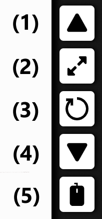
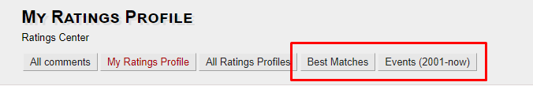
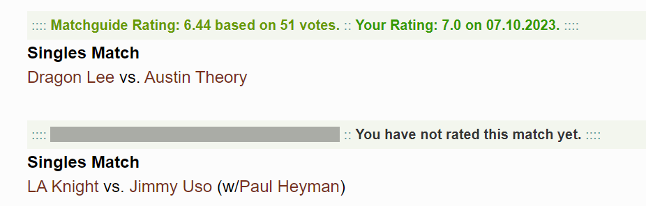
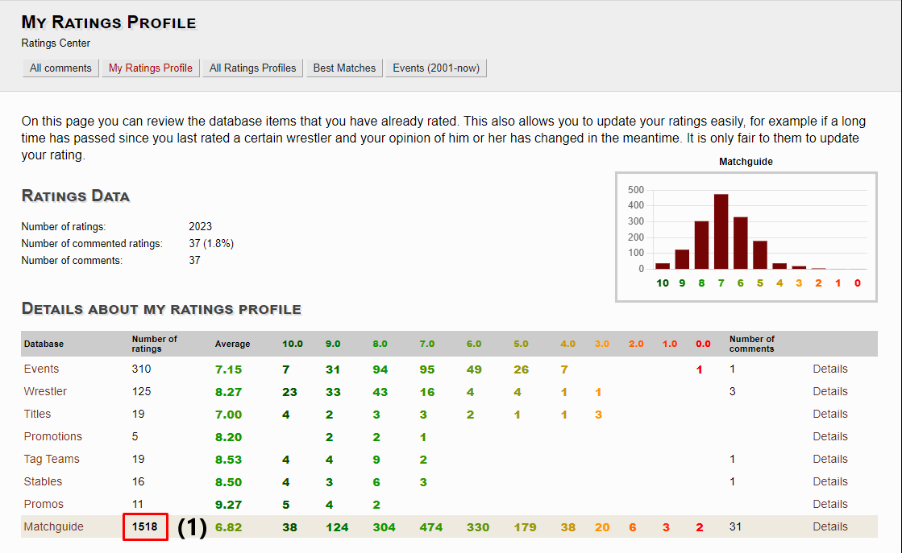
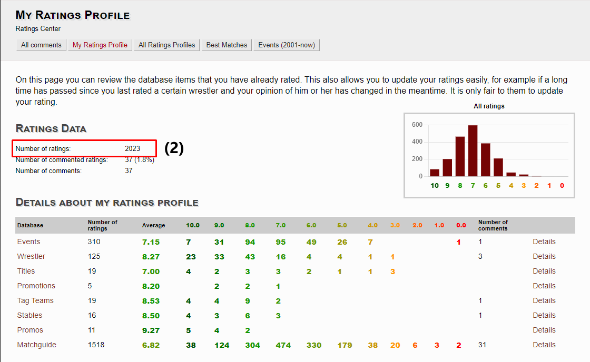
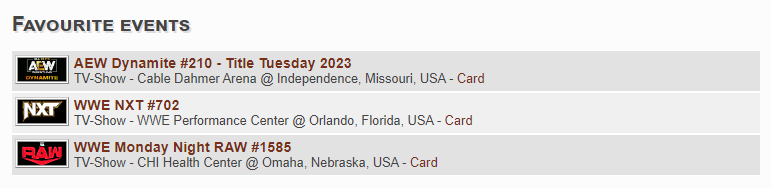
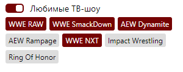
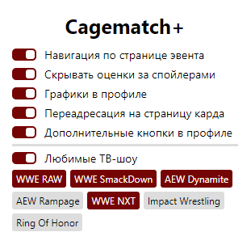

# Cagematch+
Расширеный функционал для сайта cagematch.net

## Описание
Расширение для Chrome, Яндекс.Браузер, делающее взаимодействие с Cagematch проще и приятнее. Включает в себя следующие возможности:

1. **Панель навигации по странице эвента**
<br>Надоело спойлерить себе неожиданные и неанонсированные матчи? С помощью панели навигации это больше не проблема! С помощью кнопок **"Вверх" (1)** и **"Вниз" (3)** можно перемещаться по матчам, не боясь увидеть лишнего, а с помощью кнопки **"Управление мышью" (5)** можно осуществлять навигацию еще проще - при включенной опции прокрутка колёсика мыши будет перемещать по матчам аналогично стрелкам. Так же кнопка **"Зум" (6)** позволяет включать и отключать приближение экрана, а кнопка **"Ресет" (5)** вернет страницу в изначальное положение. Все состояния, отвечающие за навигацию по конкретному, сохраняются в сессионном хранилище, а состояние кнопки 5 синхронизируется между устройствами.
<br><br>

2. **Улучшенная навигация по сайту**
* При переходе по любой ссылке ведущей на страницу эвента, сайт открывает страницу карда, а не результатов матчей - снова защита от случайных спойлеров.
* В профиль добавлены две кнопки - *топ лучших матчей по оценкам на сайте* и *список эвентов за последние 20+ лет* для быстрого доступа к этим разделам.
<br><br>

3. **Скрытие оценок за спойлером**
<br>Если матч еще не был оценен пользователем, оценка будет скрыта за спойлером - её можно показать, нажав на сам спойлер.
<br><br>

4. **Графики пользовательских оценок**
<br>В профиле теперь присутствует график, показывающий распределение оценок пользователя. По умолчанию на нём представлена информация по всем оценкам, но при нажатии на **Number of ratings (1)** рядом с каждым из разделов, можно увидеть статистику непосредственно по каждому из них. Снова показать общую статистику можно, нажав на общий **Number of ratings (2)**
<br><br> 

5. **Любимые ТВ-шоу**
<br>На главной странице сайта теперь есть раздел "Favourite events", куда будут попадать избранные шоу за последние дни - больше не нужно выискивать их среди десятка хаус-шоу.
<br><br> 

6. **Управление функционалом**
<br>Все вышеперечисленные функции легко включаются и выключаются с помощью чекбоксов в попапе расширения - настройте расширение под себя! Стейт настроек синхронизируется между устройствами.
<br><br>

## Стек технологий
HTML, CSS, TypeScript, React

## Запуск проекта
1. Чтобы использовать расширение в распакованном виде, для начала установим пакеты
```
npm install
npm run build
```
2. Перейдем в браузере по адресу browser://extensions/
3. Включив режим разработчика, нажмём 'Загрузить распакованное расширение', добавим в указанном окне папку build проекта

## Планы на будущее
* Функция избранного со своим бэкендом. Возможность добавления эвентов и матчей в БД по нажатию кнопки на странице ([Заготовка бэкенда на express.js](https://github.com/SimonMatveev/cagematch-backend))
